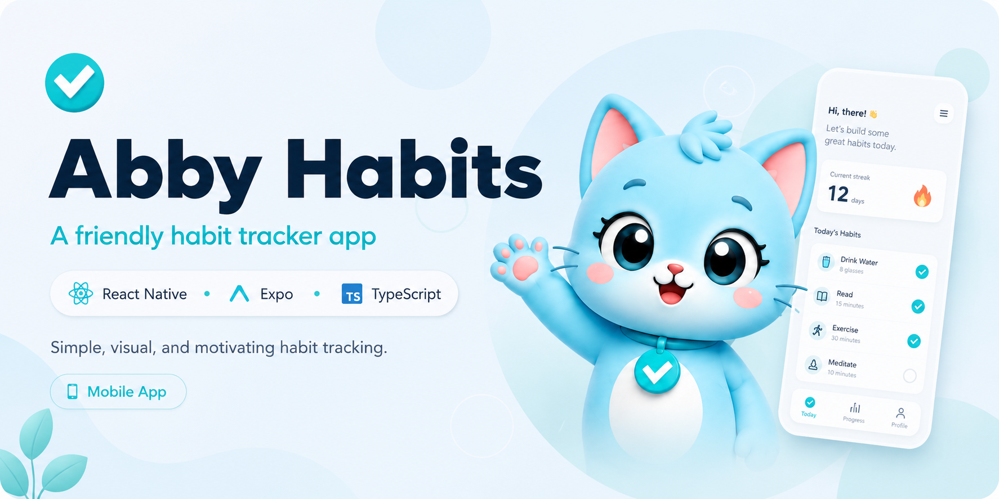

<p align="center">
  
</p>

# 🐾 Abby Habits

**Abby Habits** is a friendly habit tracker app built around a small mascot assistant named **Abby**.

The idea is simple: instead of creating habits through cold forms from the start, the user can talk with Abby in natural language, turn that intention into an editable habit card, and then track daily progress with clear visual feedback.

The project was built as a quick product sprint to explore mobile UX, habit logic, local persistence, mascot-driven interaction, and a clean technical structure using **Expo**, **React Native** and **TypeScript**.

---

## ✨ Overview

Abby Habits focuses on making habit tracking feel more approachable.

The app helps the user:

* Create habits from natural language.
* Review and adjust the generated habit card.
* Track daily progress with quick actions.
* See immediate feedback from Abby.
* Visualize daily progress and streaks.
* Keep local history across sessions.

The MVP is centered around one core question:

> Can a habit app feel simple, visual and emotionally supportive without becoming overwhelming?

---

## 🧩 Core Flow

The main MVP flow is:

1. **Meet Abby**
   The user enters their name and arrives at the main habit space.

2. **Talk with Abby**
   Abby asks what the user wants to improve.

3. **Describe a habit naturally**
   Example:
   `"tomar 2 litros de agua por día"`
   `"leer 10 páginas"`
   `"dormir 8 horas"`

4. **Generate an editable habit card**
   The app creates a structured habit with name, type, unit, frequency, minimum goal, ideal goal and quick buttons.

5. **Track progress from Today**
   The habit appears in the main screen with fast actions to register progress.

6. **See feedback and history**
   Abby reacts depending on the current state of the day, while the app stores daily progress locally.

---

## 🛠️ Tech Stack

| Layer          | Technology                   |
| -------------- | ---------------------------- |
| Mobile runtime | React Native                 |
| UI             | React                        |
| Language       | TypeScript                   |
| Framework      | Expo SDK                     |
| Bundler        | Metro                        |
| State          | Zustand                      |
| Persistence    | AsyncStorage                 |
| Navigation     | React Navigation             |
| Web support    | React Native Web + React DOM |

---

## 🚀 Getting Started

Install dependencies:

```bash
npm install
```

Run the app on web:

```bash
npm run web
```

Run on Android:

```bash
npm run android
```

Run on iOS:

```bash
npm run ios
```

Start Expo:

```bash
npm start
```

To test on a physical phone without compiling the app, install **Expo Go**, run `npm start`, and scan the QR code.

---

## 📁 Project Structure

The code is organized into clear layers so the project can grow without mixing UI, domain logic and persistence.

```txt
src/
├── core/
│   ├── habit-engine/
│   │   ├── types.ts
│   │   ├── engine.ts
│   │   ├── parser.ts
│   │   └── index.ts
│   │
│   └── mascot/
│       ├── personality.ts
│       ├── messages.ts
│       ├── conversation.ts
│       └── index.ts
│
├── data/
│   ├── storage.ts
│   └── id.ts
│
├── store/
│   └── useStore.ts
│
└── ui/
    ├── theme.ts
    ├── components/
    └── screens/
```

---

## 🧠 Architecture

The project is intentionally separated into four main areas:

### `core/habit-engine`

Pure habit logic.

This layer contains the domain types and calculations used to understand habit progress, daily status, streaks and goal completion.

It does not depend on React, UI components or storage.

### `core/mascot`

The conversational and emotional layer.

This is where Abby’s personality, contextual messages, moods and habit creation conversation live.

### `data`

Persistence and utility adapters.

This layer handles local storage using AsyncStorage and keeps data-related implementation details outside the domain logic.

### `ui`

The React Native interface.

Screens, components and visual styles live here. The UI consumes the domain and store, but the core logic does not depend on the UI.

---

## 🧪 Natural Language Habit Creation

The MVP includes an offline natural language parser that transforms simple user messages into a structured habit draft.

Example:

```txt
Input:
"tomar 2 litros de agua por día"

Output:
Habit draft:
- Name: Tomar agua
- Type: Quantity
- Unit: Liters
- Minimum goal: 1
- Ideal goal: 2
- Frequency: Daily
- Quick actions: +0.25, +0.5, +1
```

The parser is designed as a replaceable piece of the system.

Today it works with local heuristics, but the architecture allows replacing it later with an AI-based parser without rewriting the rest of the app.

---

## ✅ MVP Features

* Friendly onboarding with Abby.
* Habit creation through natural language.
* Editable habit card.
* Quantity-based habit tracking.
* Quick progress buttons.
* Daily progress state.
* Contextual mascot messages.
* Local persistent storage.
* Progress summary.
* Streak tracking.
* Web and mobile-ready Expo setup.

---

## 🧭 Possible Future Improvements

These are not required for the MVP, but show where the product could evolve if development continued:

* Deeper statistics and progress insights.
* Flexible goals depending on the day or habit type.
* More personality states for Abby.
* Widgets or quick access actions.
* Sync and backup across devices.

---

## 🎯 Goal of the Project

This project was not about building a huge habit platform.

The goal was to take a small product idea and turn it into a functional, visually consistent and technically organized case study.

It was also part of my learning process as a **Technical Artist**, using a concrete project to strengthen skills around product thinking, UI implementation, logic, documentation and tool-like digital experiences.

---

## 📌 Current Status

The MVP is functional.

It includes the full core loop:

```txt
Talk with Abby → Create habit → Edit card → Track progress → See feedback
```

The project can be run locally, tested on web, and extended into a mobile app through Expo.

---

## 🧾 License

This project is currently a personal case study.